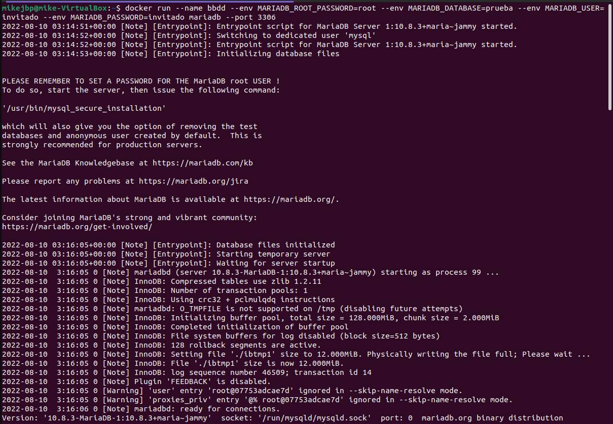
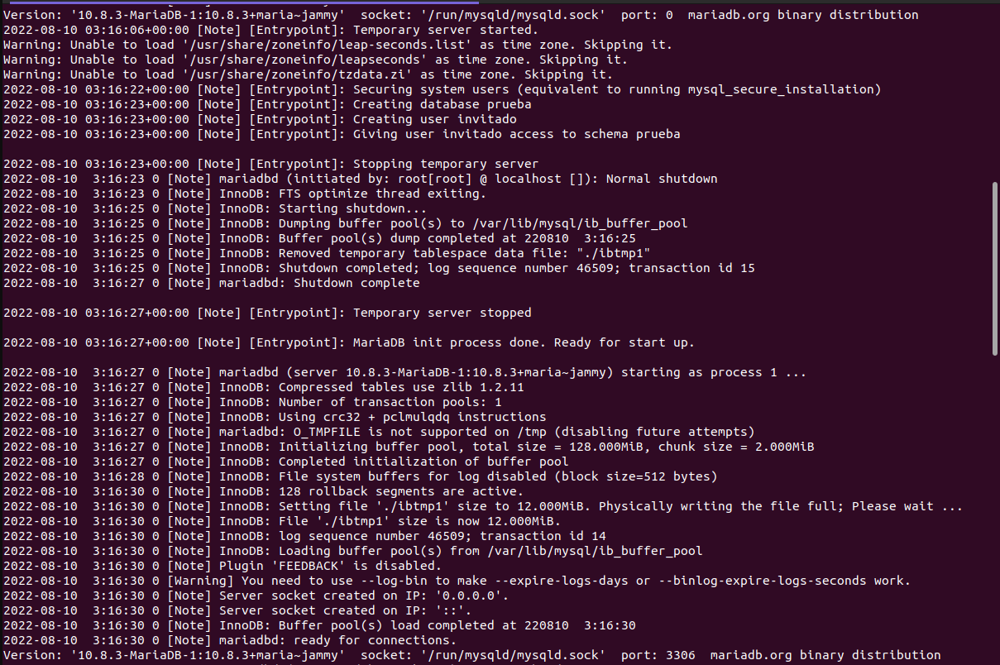
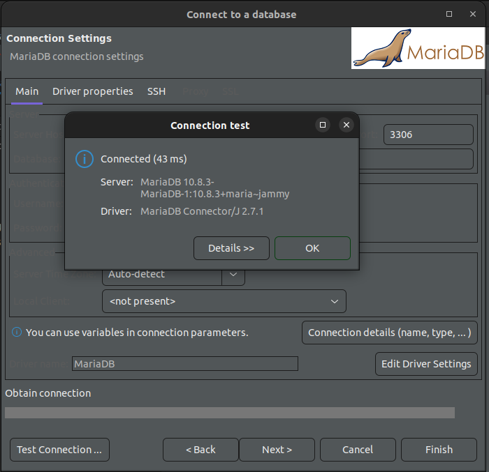
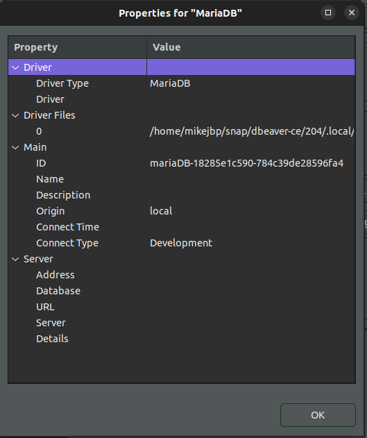
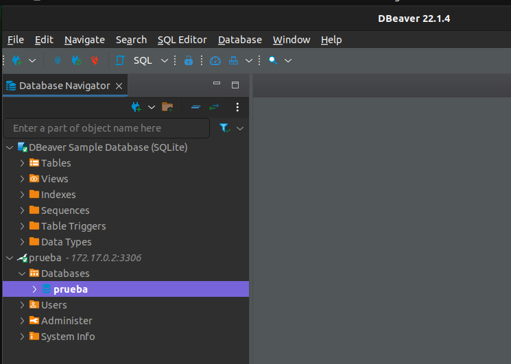
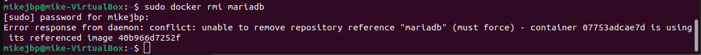

# Solucion - Reto 2: Trabajo con imágenes

## Servidor de base de datos

1. Arrancar un contenedor que se llame `bbdd` y que ejecute una instancia de la imagen **mariadb** para que sea accesible desde el puerto 3306. Establecer variables de entorno.

   ​	Lanzamos el comando en primer plano para poder leer los posibles mensajes de error que puedan surgir mientras trabajamos desde otra consola. 
   
   ```bash
   docker run --name bbdd 
   --env MARIADB_ROOT_PASSWORD=root 
   --env MARIADB_DATABASE=prueba 
   --env MARIADB_USER=invitado
   --env MARIADB_PASSWORD=invitado
   mariadb --port 3306
   ```
   
   ​	

   ​	
   
<hr />

2. Pantallazo de la conexión al servidor de base de datos con el usuario creado y de la base de datos `prueba` creada automáticamente.

   ​	Y comprobamos que podemos acceder a la base de datos y que nuestro esquema `prueba` está creado
   

   ​	

   ​	

   ​	

Para obtener la **IP** del contenedor tuve que ejecutar el comando:
```
docker ps
docker inspect [CONTAINER_ID]
```

De esta manera pude conectarme a la Base de Datos creada, ingresando la **IP** del contenedor creado en el *Server Host*.

<hr />

3. Pantallazo donde se comprueba que no se puede borrar la imagen `mariadb` mientras el contenedor `bbdd` está creado.

```bash
sudo docker rmi mariadb
```

   ​	
