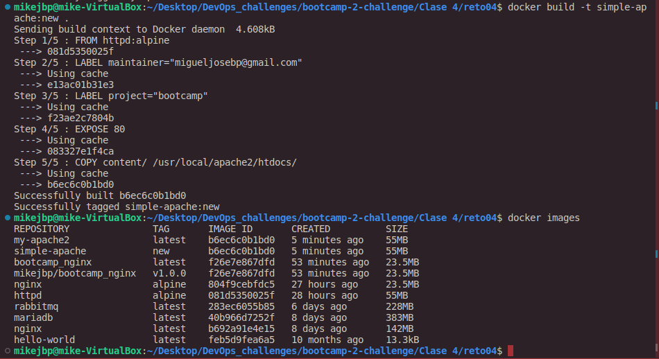
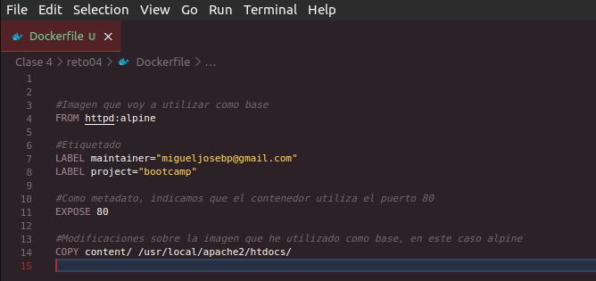
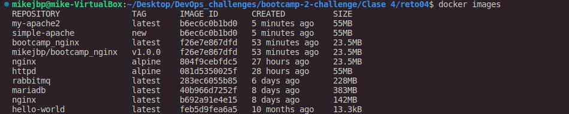
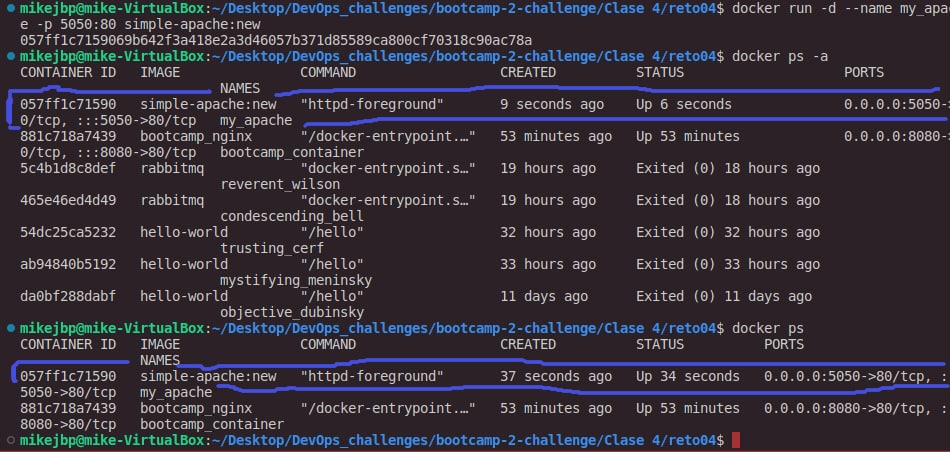
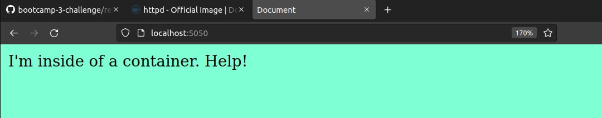
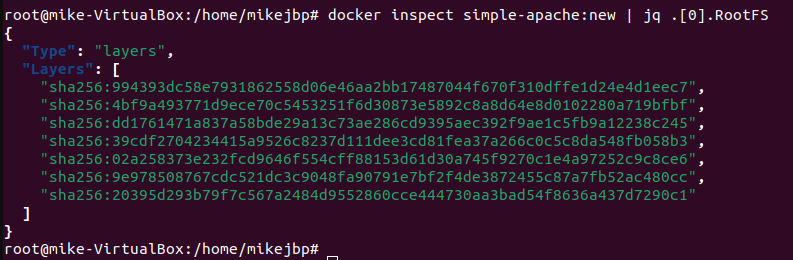

# Solución - Reto 4: Contenedores Docker

### Ejercicio 1 - Crear imagen de `Apache`

Crea una imagen con un servidor web Apache y el mismo contenido que en la carpeta [content](content).

Usa docker build para crear la imagen llamada ```simple-apache:new``` 


<br>

1. Cambiar
2. Buscar en ```Docker Hub``` la imagen de ```Apache```
3. Cambiar los valores para que:
   1. La imagen base sea este otro servidor
   2. El contenido se copie donde apache sirve los archivos.
<br>

**Resultado**: <br>



<hr />

### Ejercicio 2 - Crear contenedor desde la nueva imagen

- Ejecutar tu nueva imagen
- El contenedor se debe llamar ```my_apache```
- Debes usar el puerto __5050__ de tu __localhost__ para poder acceder a él.





__Resultado:__



<hr />

### Ejercicio 3 - Inspeccionar la imagen

Averiguar cuántas capas tiene mi nueva imagen

**Respuesta**:



La imagen `simple-apache:new` está constituida de 7 capas.

