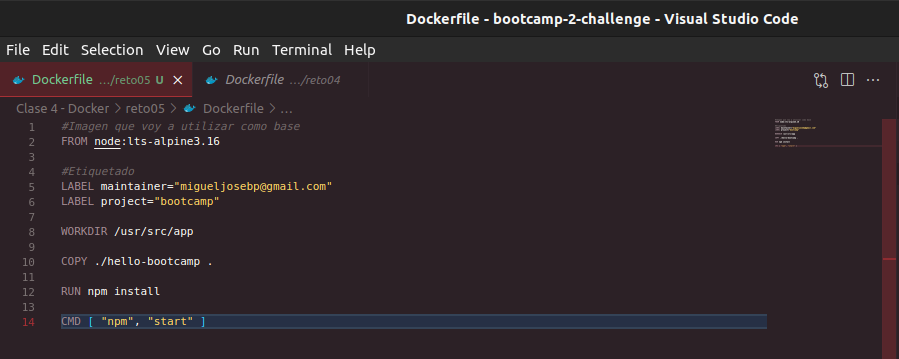

# Solución - Reto 5: Containerizar aplicacion `Node.js`

1. Crear archivo `Dockerfile`:

Dockeriza la carpeta [hello-bootcamp](hello-bootcamp) Antes de hacerlo ¡pruébala en local! Genera la imagen con el VS Code

- Ejecuta un contenedor con la imagen

- Subir la aplicacion en registry

- Crear el Script que permita realizar todo lo antes mencionado

