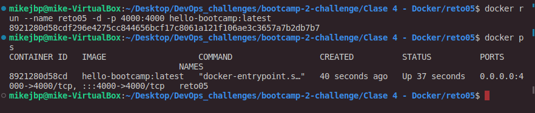

# Solución - Reto 5: Containerizar aplicacion `Node.js`

1. **Crear archivo `Dockerfile`**:

- Le indicamos la imagen [Node.js](https://hub.docker.com/_/node/tags)
- Le indicamos al **contenedor** el espacio de trabajo (`WORKDIR`) para cuando éste se ejecute sea en `usr/src/app`
- Le decimos que haga una copia (`COPY`) en la carpeta [hello-bootcamp](hello-bootcamp), haciendo referencia al `path` anterior en el espacio de trabajo.

- Como estamos trabajando con `Node.js`, debemos indicar que instale todas las dependencias con `npm install`
- Por último que inicie el servidor con `npm start`

2. **Construir la imagen**:

- Se crea la imagen en base al [Dockerfile](Dockerfile) con el comando: `docker build -t hello-bootcamp .`
  Crea la imagen llamada `hello-bootcamp` dentro del espacio de trabajo.
- Una vez hecho, inspeccionamos con: `docker ps` para corroborar que la imagen nueva está allí.
  Nos indica la imagen creada exitosamente `hello-bootcamp:latest`, es la que usaremos para el contenedor.

Dockeriza la carpeta [hello-bootcamp](hello-bootcamp) Antes de hacerlo ¡pruébala en local! Genera la imagen con el VS Code

- **Ejecuta un contenedor con la imagen**

* Con el comando `docker run --name reto05 -d -p 4000:4000 hello-bootcamp:latest`.  
  
* Creamos un contenedor llamado `reto05` con la imagen `hello-bootcamp:latest` creada previamente.
* Gracias al archivo [server.js](hello-bootcamp/server.js) podemos darnos cuenta que ya nos está indicando que escuche al puerto `4000`, por eso se lo colocamos al crear el contenedor.
* Corroboramos que éste creado exitosamente con `docker ps`.

  
- Nos vamos al navegador y hacemos la prueba en local, yendo a `localhost:4000`.

- **Subir la aplicacion en registry**

Lo recomendable es ir a **DockerHub**, estando iniciados en el navegador y crear un repositorio nuevo para esto.  
  
* Iniciamos sesión desde la terminal con `docker login`.
* Luego hacemos `tag` del contenedor con: `docker tag hello-bootcamp mikejbp/reto05docker:latest`  
  Acá le estamos diciendo que vas a usar la imagen `hello-bootcamp` y la vas a llevar al repositorio `reto05docker` en nuestro usuario.
* Y por último *pusheamos* eso para que se suba a nuestro repositorio creado: `docker push mikejbp/reto05docker:latest`.

  
Y ya está la imagen en el repostiorio [reto05docker](https://hub.docker.com/repository/docker/mikejbp/reto05docker) que se ha creado.

- **Crear el Script que permita realizar todo lo antes mencionado**

Acá está el [script](reto05.sh) creado con los pasos anteriores para este reto.

