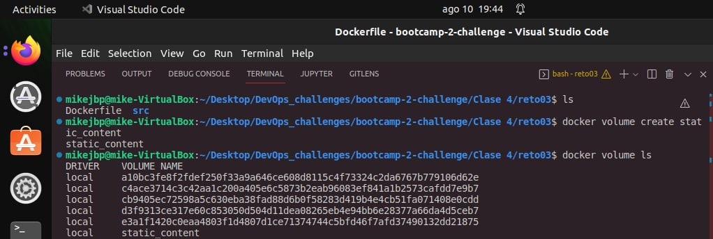
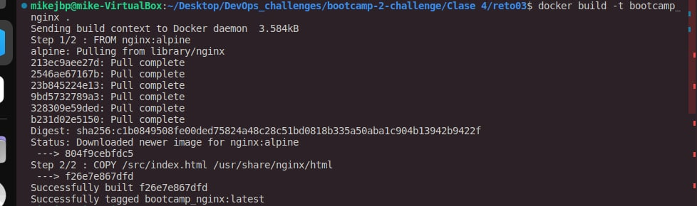
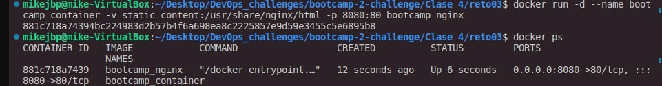
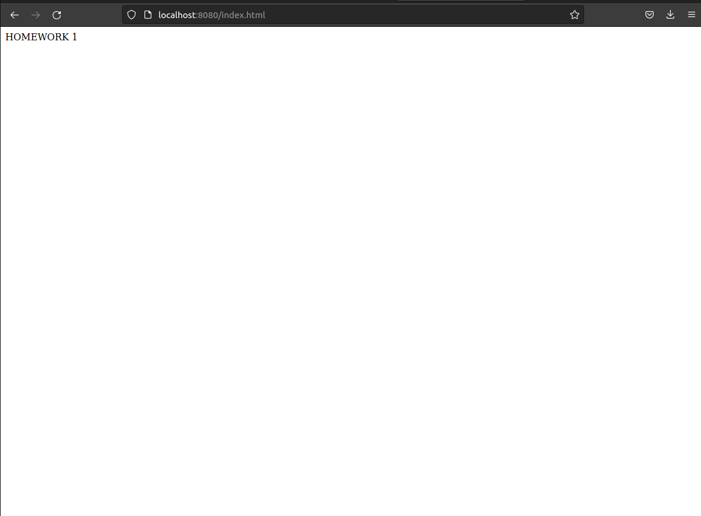
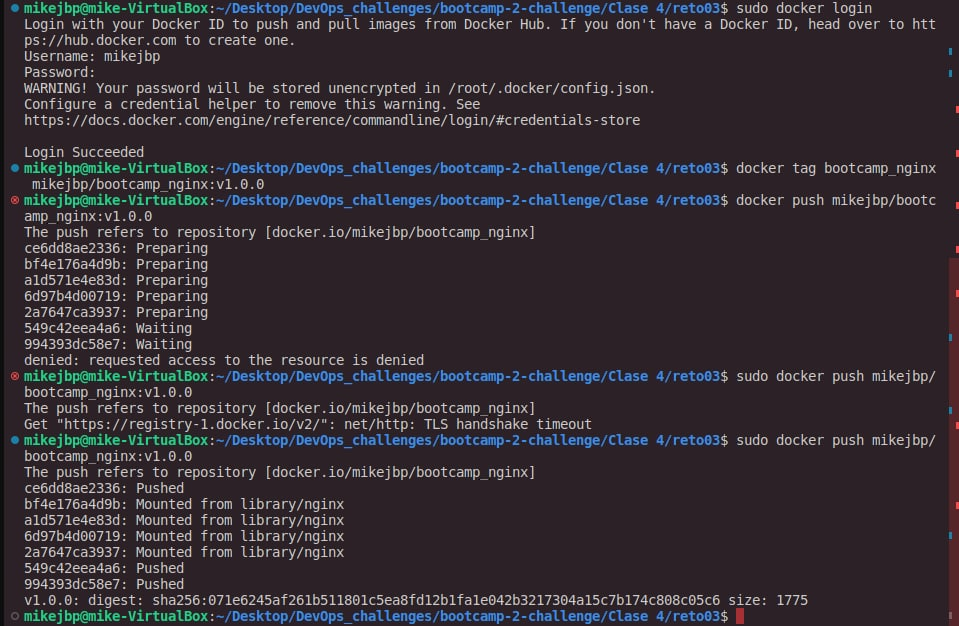
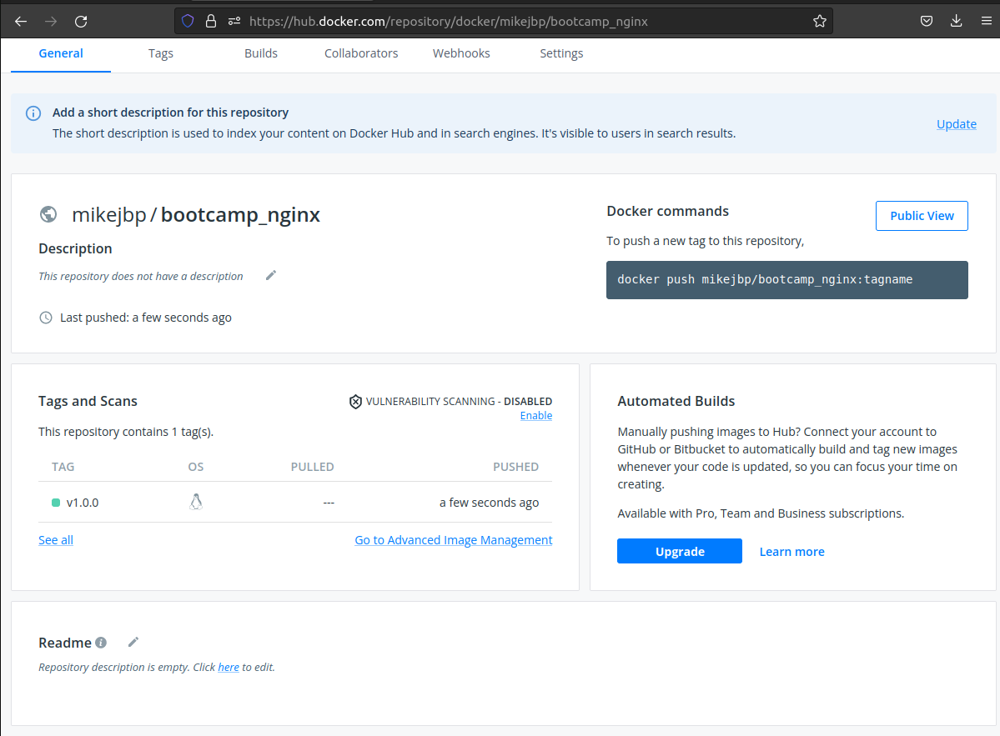

# Solución - Reto 3: Docker

## Crea un contenedor con las siguientes especificaciones:
	a. Utilizar la imagen base NGINX haciendo uso de la version nginx:alpine
	b. Al acceder a la URL localhost:8080/index.html aparecer el mensaje HOMEWORK 1
	c. Persistir el fichero index.html en un volumen llamado static_content

### Paso 1: Crear el fichero Dockerfile. Las instrucciones que se han utilizado para el fichero son:
```
	- Utilizar la imagen de nginx con la version requerida
	FROM nginx:alpine
	
	- Copiar el archivo index.htm de la carpeta src desde el host a la carpeta del contenedor
	COPY /src/index.html /usr/share/nginx/html
```	

Puedes vero aquí: **[Dockerfile](Dockerfile)**
<hr />

### Paso 2: Crear un volumen 'static_content' en el CLI de Docker mediante la siguiente instruccion
	```docker volume create static_content ```
  

 
Se puede apreciar el volumen `satic content` al final.

<hr />
	
### Paso 3: Construir la imagen del contenedor. El nombre de la imagen es 'bootcamp_nginx'
	```docker build -t bootcamp_nginx . ```
  

	
<hr />

### Paso 4: Crear el contenedor	con nombre 'bootcamp_container' utilizando la imagen construida en el paso 3
	- Mediante el parametro -v hacemos que el volumen 'static_content' creado en el paso 2 apunte al directorio del contenedor donde se encuentra el archivo index.html. De esta forma persistimos todo el contenido del directorio /usr/share/nginx/html del contenedor en el volumen

	```docker run -d --name bootcamp_container -v static_content:/usr/share/nginx/html -p 8080:80 bootcamp_nginx ```



Contenedor `bootcamp_container` creado.

<hr />

### Paso 5: Acceder a la URL http://localhost:8080/index.html y comprobar que aparece la pagina deseada



<hr />

### Paso 6: Deploy to Registry DockerHub

- Recuerda que debes contar con una cuenta en https://hub.docker.com
- Logeate en docker-hub desde la terminal
- Ubicar el usuario de dockerhub, que con ese vas autheticarte
- Documentacion [Docker](https://docs.docker.com/engine/reference/commandline/login/)
```docker login````
```docker login -u "myusername" -p "mypassword" docker.io```
- tagear la imagen
```docker tag bootcamp_nginx roxsross12/bootcamp_nginx:v1.0.0 ```
- Push en el registry
```docker push roxsross12/bootcamp_nginx:v1.0.0```
- Listo





[Deploy to Registry DockerHub](https://hub.docker.com/repository/docker/mikejbp/bootcamp_nginx)

